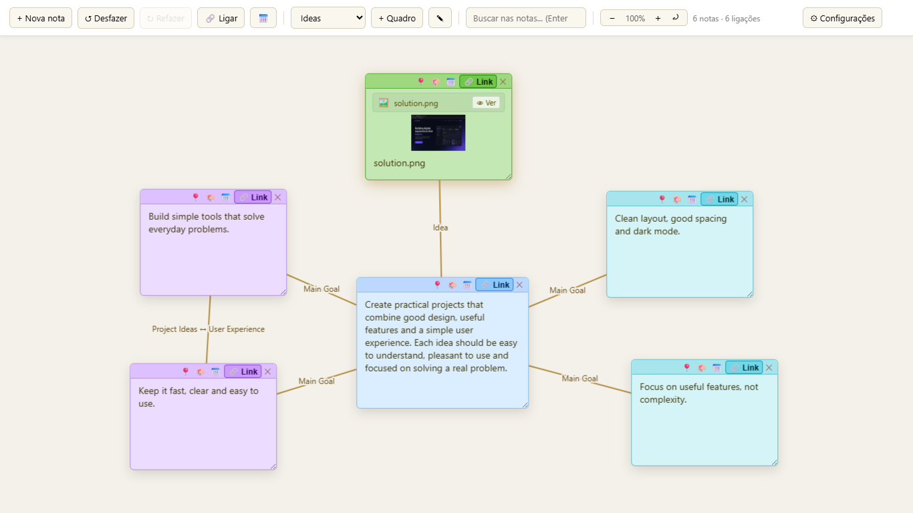
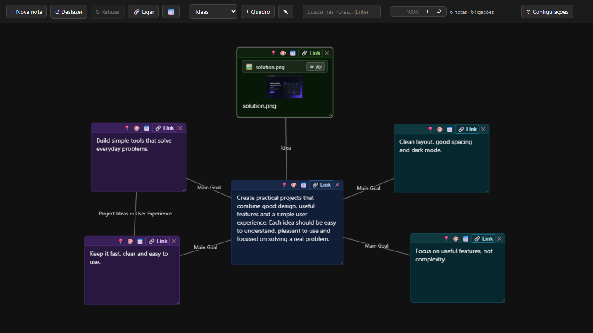
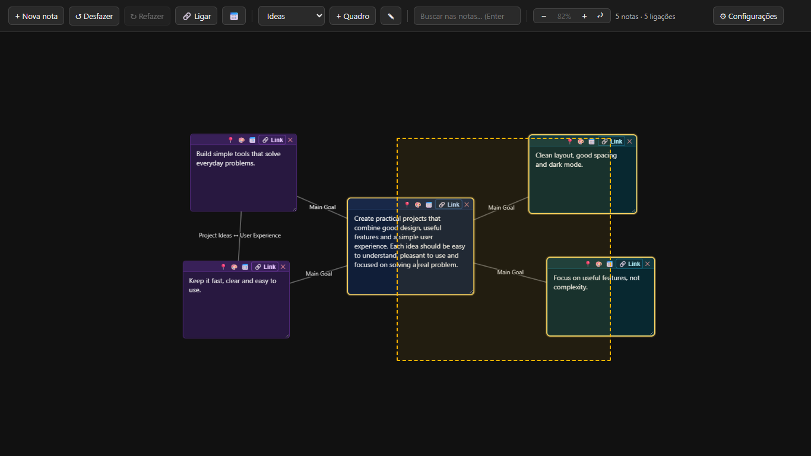

# Floating Notes / Notas Flutuantes


A browser-based visual notes board for organizing ideas using **floating notes, connections, files, multiple boards and an infinite workspace**.

<p align="center">
  <a href="https://ink-creator.github.io/Notas-flutuantes/">
    
  </a>
</p>

[English](#english) · [Português](#português)

---

## Demo

<!--
Drag the MP4 into the GitHub README editor and place the generated
github.com/user-attachments/... URL on the line below this comment.
-->

---

## Preview

<table>
  <tr>
    <td align="center" colspan="2">
      <strong>Visual Organization & File Support</strong><br><br>
      
    </td>
  </tr>
  <tr>
    <td align="center" width="50%">
      <strong>Dark Mode</strong><br><br>
      
    </td>
    <td align="center" width="50%">
      <strong>Multi-selection</strong><br><br>
      
    </td>
  </tr>
</table>

---

# English

## About

**Floating Notes** is a browser-based visual organization tool built with pure HTML, CSS and JavaScript.

Instead of organizing information only as a traditional list, notes can be freely positioned across an expandable workspace and connected to represent relationships between ideas.

The application runs directly in the browser and requires no installation, account or backend.

---

## Features

### Floating Notes

Notes can be:

- Created anywhere on the board
- Dragged freely
- Resized
- Colored
- Pinned in place
- Deleted individually or in groups

Double-clicking an empty area also creates a new note.

---

### Connections Between Notes

Notes can be visually connected using lines.

Connections can:

- Link two notes
- Be removed later
- Receive custom labels
- Move automatically with the connected notes

This makes the board useful for:

- Brainstorming
- Project planning
- Idea mapping
- Simple mind maps
- Visual organization

---

### Multi-selection

Multiple notes can be selected at the same time.

You can:

- Hold `Shift` and drag to create a selection rectangle
- Use `Shift + click` to add or remove individual notes
- Move selected notes together
- Copy groups of notes
- Delete multiple notes at once

Connections between copied notes are preserved when possible.

---

### Files and Images

Files can be dragged directly onto the board.

Supported features include:

- Image previews
- Text files
- Markdown files
- CSV files
- JSON files
- Editable text content
- Built-in file viewer
- Folder shortcuts

Images can be displayed directly inside notes.

---

### Links and Local Paths

Notes can contain clickable links.

Supported destinations include:

- Websites
- URLs
- Local files
- Local folders

Links are displayed as small badges inside the note.

They can be opened using the built-in viewer or directly in the browser when supported.

---

### Multiple Boards

The application supports multiple independent boards.

For example:

```text
Work
Personal
Ideas
Projects
Study
```

Boards can be:

- Created
- Renamed
- Switched instantly
- Deleted

Each board keeps its own notes and connections.

---

### Search

The search field can locate content across the current board.

Matching notes are highlighted and `Enter` can be used to navigate between results.

---

### Infinite Workspace

The board supports navigation using:

- Zoom in
- Zoom out
- Zoom reset
- Mouse-centered zoom
- Click and drag to move around the workspace

This allows larger diagrams and note structures to be created without being restricted to a fixed canvas.

---

### Calendar

A floating calendar is available from the toolbar.

Selecting a date can insert it directly into the active note.

---

### Copy and Paste

Notes can be copied using standard keyboard shortcuts.

```text
Ctrl + C
Ctrl + V
```

Copied notes preserve information such as:

- Text
- Color
- Size
- Relative positioning
- Internal connections when copying groups

---

### Undo and Redo

Actions can be reverted using:

```text
Ctrl + Z
```

and restored using:

```text
Ctrl + Shift + Z
Ctrl + Y
```

Undo and redo controls are also available directly in the toolbar.

---

### Dark Mode

Floating Notes includes light and dark themes.

The selected appearance is automatically remembered by the browser.

---

## Saving and Backups

Notes are saved automatically using browser storage.

No account or server is required.

Because the data is stored locally, opening the application in another browser or computer starts with an empty workspace.

To move or back up your data, the application supports JSON export and import.

### Export

You can export:

- All boards
- Only the current board

The exported backup can contain:

- Notes
- Board names
- Connections
- Colors
- Images
- Attached files
- Other saved state

### Import

A previously exported backup can be imported to restore the workspace.

Older single-board backup formats are also supported.

---

## Keyboard Shortcuts

| Shortcut | Action |
| --- | --- |
| `L` | Toggle connection mode |
| `Delete` / `Backspace` | Delete selected notes |
| `Ctrl + C` | Copy selected notes |
| `Ctrl + V` | Paste |
| `Ctrl + Z` | Undo |
| `Ctrl + Shift + Z` / `Ctrl + Y` | Redo |
| `Esc` | Cancel connection mode / close panels |
| `Shift + drag` | Rectangle multi-selection |
| `Shift + click` | Add/remove note from selection |

---

## Live Demo

The complete application can be used directly through GitHub Pages:

**https://ink-creator.github.io/Notas-flutuantes/**

No installation is required.

---

## Running Locally

Clone the repository:

```bash
git clone https://ink-creator.github/Notas-flutuantes/.git
```

Or download it as a ZIP.

Keep these files together:

```text
index.html
style.css
script.js
```

Then open:

```text
index.html
```

in a modern browser.

---

## Technologies

Floating Notes was built with:

- HTML
- CSS
- JavaScript
- Browser Local Storage
- File APIs

No frameworks, backend or external dependencies are required.

---

## Project Structure

```text
Notas-flutuantes/
├── assets/
│   └── screenshots/
│       ├── light-overview.png
│       ├── dark-overview.png
│       └── multi-selection.png
├── index.html
├── style.css
├── script.js
├── LICENSE
└── README.md
```

---

# Português

## Sobre

**Notas Flutuantes** é uma ferramenta visual de organização executada diretamente no navegador e desenvolvida utilizando HTML, CSS e JavaScript puro.

Em vez de organizar informações apenas como uma lista tradicional, as notas podem ser posicionadas livremente em um espaço expansível e conectadas para representar relações entre diferentes ideias.

A aplicação funciona diretamente no navegador e não precisa de instalação, conta ou backend.

---

## Funcionalidades

### Notas Flutuantes

As notas podem ser:

- Criadas em qualquer lugar do quadro
- Arrastadas livremente
- Redimensionadas
- Coloridas
- Fixadas no lugar
- Excluídas individualmente ou em grupo

Também é possível criar uma nova nota dando dois cliques em uma área vazia.

---

### Ligações Entre Notas

As notas podem ser conectadas visualmente por linhas.

As ligações podem:

- Conectar duas notas
- Ser removidas posteriormente
- Receber nomes personalizados
- Acompanhar automaticamente a movimentação das notas

Isso permite utilizar o quadro para:

- Brainstorming
- Planejamento de projetos
- Organização de ideias
- Mapas mentais simples
- Organização visual

---

### Seleção Múltipla

Várias notas podem ser selecionadas ao mesmo tempo.

É possível:

- Segurar `Shift` e arrastar para criar uma área de seleção
- Utilizar `Shift + clique` para adicionar ou remover notas
- Mover várias notas juntas
- Copiar grupos de notas
- Excluir várias notas de uma vez

As ligações internas entre notas copiadas também podem ser preservadas.

---

### Arquivos e Imagens

Arquivos podem ser arrastados diretamente para o quadro.

Entre os recursos disponíveis estão:

- Visualização de imagens
- Arquivos de texto
- Markdown
- CSV
- JSON
- Conteúdo textual editável
- Visualizador interno
- Atalhos para pastas

Imagens podem aparecer diretamente dentro das notas.

---

### Links e Caminhos Locais

Notas podem armazenar links clicáveis.

É possível utilizar:

- Sites
- URLs
- Arquivos locais
- Pastas locais

Os links são apresentados como pequenos badges dentro das notas.

Quando suportado, podem ser abertos no visualizador interno ou diretamente no navegador.

---

### Múltiplos Quadros

A aplicação permite criar vários quadros independentes.

Por exemplo:

```text
Trabalho
Pessoal
Ideias
Projetos
Estudos
```

Os quadros podem ser:

- Criados
- Renomeados
- Alternados rapidamente
- Excluídos

Cada quadro mantém suas próprias notas e ligações.

---

### Busca

A caixa de pesquisa permite encontrar conteúdo dentro do quadro atual.

As notas correspondentes ficam destacadas e a tecla `Enter` permite navegar entre os resultados.

---

### Espaço de Trabalho Expansível

O quadro possui controles de navegação como:

- Aumentar zoom
- Diminuir zoom
- Restaurar zoom
- Zoom centralizado no cursor
- Arrastar o fundo para navegar

Isso permite criar estruturas maiores sem ficar limitado a uma área fixa.

---

### Calendário

Um calendário flutuante pode ser aberto pela barra superior.

Ao clicar em um dia, a data pode ser inserida diretamente na nota ativa.

---

### Copiar e Colar

Notas podem ser copiadas utilizando os atalhos tradicionais:

```text
Ctrl + C
Ctrl + V
```

As cópias podem preservar:

- Texto
- Cor
- Tamanho
- Posição relativa
- Ligações internas ao copiar grupos

---

### Desfazer e Refazer

Ações podem ser desfeitas utilizando:

```text
Ctrl + Z
```

e refeitas utilizando:

```text
Ctrl + Shift + Z
Ctrl + Y
```

Os controles também ficam disponíveis diretamente na barra superior.

---

### Modo Escuro

Notas Flutuantes possui temas claro e escuro.

A preferência selecionada é salva automaticamente pelo navegador.

---

## Salvamento e Backup

As notas são salvas automaticamente utilizando o armazenamento do navegador.

Nenhuma conta ou servidor é necessário.

Como os dados ficam armazenados localmente, abrir a aplicação em outro navegador ou computador começa com um espaço vazio.

Para transportar ou fazer backup dos dados, é possível utilizar exportação e importação em JSON.

### Exportação

É possível exportar:

- Todos os quadros
- Apenas o quadro atual

O arquivo de backup pode armazenar:

- Notas
- Nomes dos quadros
- Ligações
- Cores
- Imagens
- Arquivos anexados
- Outros estados salvos

### Importação

Um backup anteriormente exportado pode ser importado para restaurar o espaço de trabalho.

Arquivos exportados por versões antigas com apenas um quadro também podem ser importados.

---

## Atalhos de Teclado

| Atalho | Ação |
| --- | --- |
| `L` | Ativar/desativar modo de ligação |
| `Delete` / `Backspace` | Excluir notas selecionadas |
| `Ctrl + C` | Copiar notas selecionadas |
| `Ctrl + V` | Colar |
| `Ctrl + Z` | Desfazer |
| `Ctrl + Shift + Z` / `Ctrl + Y` | Refazer |
| `Esc` | Cancelar ligação / fechar painéis |
| `Shift + arrastar` | Seleção múltipla por área |
| `Shift + clique` | Adicionar/remover nota da seleção |

---

## Demonstração Online

A aplicação completa pode ser utilizada diretamente pelo GitHub Pages:

**https://ink-creator.github.io/Notas-flutuantes//**

Nenhuma instalação é necessária.

---

## Executando Localmente

Clone o repositório:

```bash
git clone https://github.com/ink-creator/Notas-flutuantes.git
```

Ou baixe o projeto como ZIP.

Mantenha os arquivos:

```text
index.html
style.css
script.js
```

na mesma pasta.

Depois abra:

```text
index.html
```

em um navegador moderno.

---

## Tecnologias

Notas Flutuantes foi desenvolvido utilizando:

- HTML
- CSS
- JavaScript
- Local Storage do navegador
- APIs de arquivos do navegador

O projeto não depende de frameworks, backend ou bibliotecas externas.

---

## Estrutura do Projeto

```text
Notas-flutuantes/
├── assets/
│   └── screenshots/
│       ├── light-overview.png
│       ├── dark-overview.png
│       └── multi-selection.png
├── index.html
├── style.css
├── script.js
├── LICENSE
└── README.md
```

---

## License / Licença

This project is available under the **MIT License**.

Este projeto está disponível sob a **Licença MIT**.

See / Consulte [LICENSE](LICENSE).